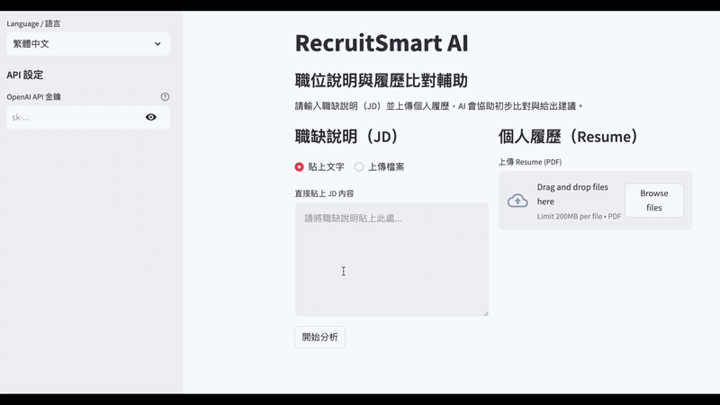

# RecruitSmart AI - 職位說明與履歷比對輔助系統
> **AI 驅動的自動化招募解決方案：連結企業需求 (JD) 與人才核心價值 (Resume)，實現大規模履歷篩選與自動化人才排序**

## 📺 快速演示 (Quick Demo)

## 專案願景 (Project Vision)
在企業數位轉型過程中，HR 部門面臨前所未有的履歷篩選壓力。傳統招募系統多仰賴「關鍵字比對 (Keyword Filtering)」，導致許多具備實戰經驗與潛力的候選人，僅因履歷遣詞用字未精確命中關鍵字而遭到誤刪。

本專案旨在透過 **AI 應用架構**，將篩選機制從僵化的比對提升至深層的 **「語意邏輯分析 (Semantic Logic Analysis)」**。我們不僅能精準識別候選人的真實技術深度，更透過「批次處理」與「智慧排序」功能，將招募專員從低效、重複的閱讀工作中解放。這能讓 HR 專注於高價值的面試決策與人才佈局，是企業導入「AI 員工」以優化低效流程、實踐數位轉型的最佳路徑

## 核心價值與亮點 (Core Value & Features)
- **語意邏輯篩選 (Semantic Screening)**：突破關鍵字限制，AI 深度理解履歷專案描述與職位需求 (JD) 的內在邏輯契合度。
- **批次自動化處理 (Batch Processing)**：支援一次上傳多份 PDF 履歷，解決 HR 面對數百份申請時的處理瓶頸。
- **智慧人才排名 (Intelligent Ranking)**：根據 AI 評分自動化生成人才清單並由高至低排序，確保優質人才第一時間浮現。
- **可解釋的 AI 評分 (Explainable AI)**：將適配度細分為技術、經驗、影響力、潛力四大維度，並提供視覺化進度條與具體理由。
- **智慧面試導航 (Interview Navigator)**：針對每位候選人的具體實戰經驗，自動生成高品質的深度追問建議。
- **雙語國際化架構**：介面與 AI 輸出內容支援中英文一鍵切換，適應跨國招募需求。
- **智慧面試導航**：根據履歷中的具體專案內容，自動生成 5 個「追問式」深度面試問題。
- **多模態數據處理**：支援 PDF 履歷解析與多種格式的職位說明 (JD) 輸入。

## 技術選型 (Tech Stack)
- **LLM Engine**: OpenAI GPT-4o (Structured Output / JSON Mode)
- **Frontend Framework**: Streamlit (Advanced State Management)
- **State Management**: `st.session_state` (處理大規模數據持久化與切換邏輯)
- **Data Engineering**: PyPDF2 (多檔案平行解析), Regex (數據清洗)
- **Architecture**: Dictionary-based i18n, Environment Variable Security

## AI 架構設計思維 (Architect's Insight)
本專案 2.0 版本致力於將 AI 深度整合進企業實際工作流：
1. **解決「規模化」痛點**：透過批次處理架構，模擬「AI 員工」的高效運作，實踐 JD 中關於自動化與效率的極致追求。
2. **優化決策品質**：利用 `Session State` 管理分析結果，實現「分析一次，多次查看」的低延遲體驗，降低 API 調用成本同時提升決策流暢度。
本專案解決了以下技術難點：
1. **輸出穩定性**：透過自定義的 `clean_json_string` 邏輯與正則表達式，克服了 LLM 夾帶 Markdown 標籤導致解析失敗的問題。
2. **提示詞工程 (Prompt Engineering)**：設計了具備「角色扮演」與「邏輯限制」的 System Prompt，確保評分嚴謹度與問題的針對性。
3. **安全與擴展性**：採用 `.env` 環境變數管理金鑰，並使用語系字典架構，未來可輕易擴展至日語、韓語等多國語系。

## 📦 安裝與執行
1. 克隆專案：`git clone https://github.com/Li-YiLing/RecruitSmart-AI.git`
2. 安裝依賴：`pip install -r requirements.txt`
3. 設定環境變數：建立 `.env` 檔案並填入 `OPENAI_API_KEY=你的金鑰`
4. 執行應用：`streamlit run app.py`
